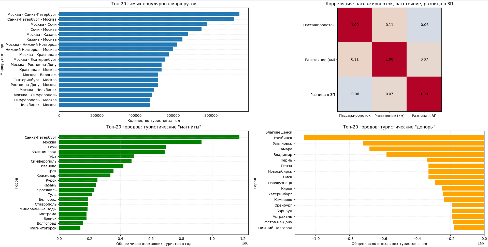
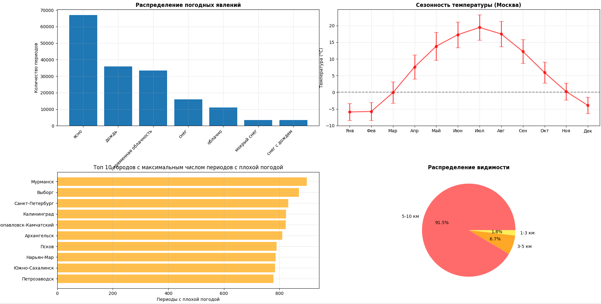
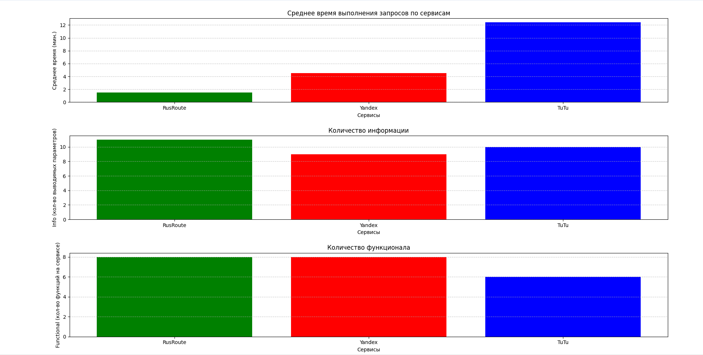

# Графики

# Выводы по анализу данных
## 1. Погодные условия как важный фактор планирования маршрута путешествий  

- **Частота неблагоприятных явлений:** Несмотря на то, что по полученным погодным данным "ясно" преобладает над остальными, значимую долю занимают все неблагоприятные явления, которые нужно учитывать при планировании маршрута, так как от этого зависит время и затраты на путешествие.
- **Города с плохой погодой:** На графике топ-10 городов (Мурманск, Выборг, Санкт-Петербург) являются важными туристическими направлениями. Для них особенно критично предлагать альтернативные маршруты или сезоны для посещения.

**Вывод:** Интеграция прогноза погоды, учитывающего сезонность и специфику региона, является важной частью для сервиса планирования маршрутов, так как это повышает комфорт путешественника и позволяет ему насладится своей поездкой.

## 2. Анализ рынка

Данные по пассажиропотокам позволяют точно определить, какие маршруты и города наиболее востребованы.

*   **Популярные маршруты:** Топ-20 самых популярных маршрутов четко указывает на доминирование связей между Москвой, Санкт-Петербургом, Сочи и Казанью. Это позволяет сфокусировать усилия на оптимизации и детализации информации именно по этим направлениям.
*   **Туристические "магниты":** Города-лидеры по количеству въезжающих туристов (Санкт-Петербург, Москва, Сочи) должны быть представлены максимально подробно, с множеством вариантов маршрутов.
*   **Туристические "доноры":** Список городов-доноров (Благовещенск, Челябинск, Ульяновск и др.) помогает понять, откуда формируется основной поток туристов.
*   **Корреляция факторов:** Корреляционная матрица показывает, что пассажиропоток слабо зависит от расстояния и разницы в заработной плате. Это говорит о том, что главным драйвером для путешествий является не экономическая доступность, а привлекательность самого направления (туристический "магнит"). Проект должен делать акцент на уникальных возможностях и опыте, которые предлагает каждое место.

**Вывод:** Проект, основанный на полученных данных о предпочтениях туристов, будет более релевантным для целевой аудитории. Он позволит пользователям легко находить популярные и проверенные маршруты, а также открывать для себя новые, но перспективные направления.

## 3. Анализ конкурентов

Сравнение с существующими сервисами (Yandex, Tutu) позволяет выявить важные конкурентные преимущества:

- **Производительность:** RusRoute(наш проект) значительно опережает конкурентов по скорости выполнения запросов (в среднем полторы минуты против 4.5 и 12 минут у основных конкурентов). Пользователи ценят скорость и мгновенный ответ, поэтому это очень важное преимущество.
- **Информативность:** RusRoute предоставляет больше параметров(10+) чем Yandex(9) и Tutu(10). Это означает, что пользователь получает более полную картину перед окончательным выбором куда поехать.
- **Функциональность:** RusRoute предлагает наибольшее количество функций(8), что делает его наиболее универсальным инструментом для планирования путешествий по России.

Проект RusRoute имеет явное конкурентное преимущество в трех ключевых аспектах: скорости, информативности и функциональности.